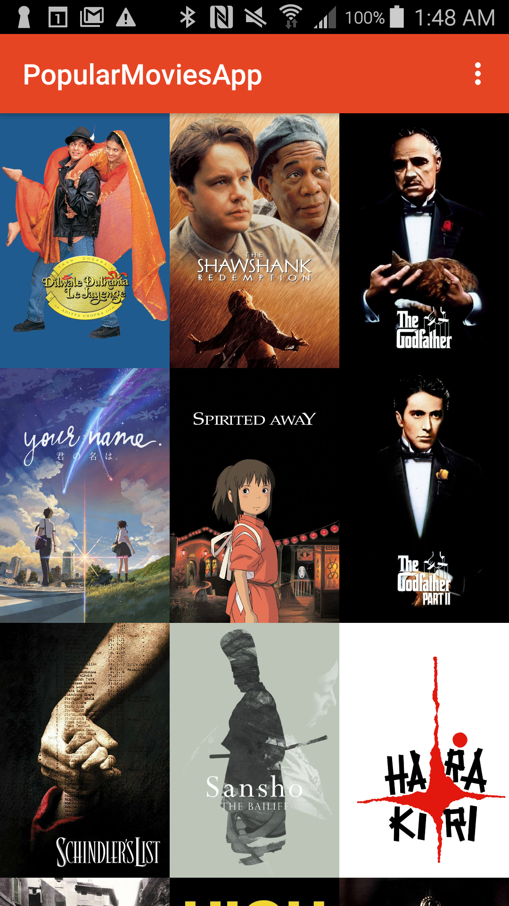
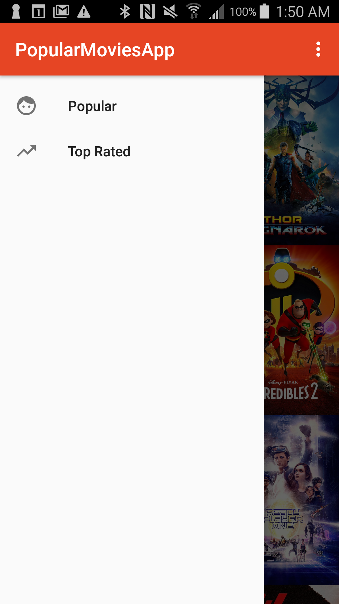
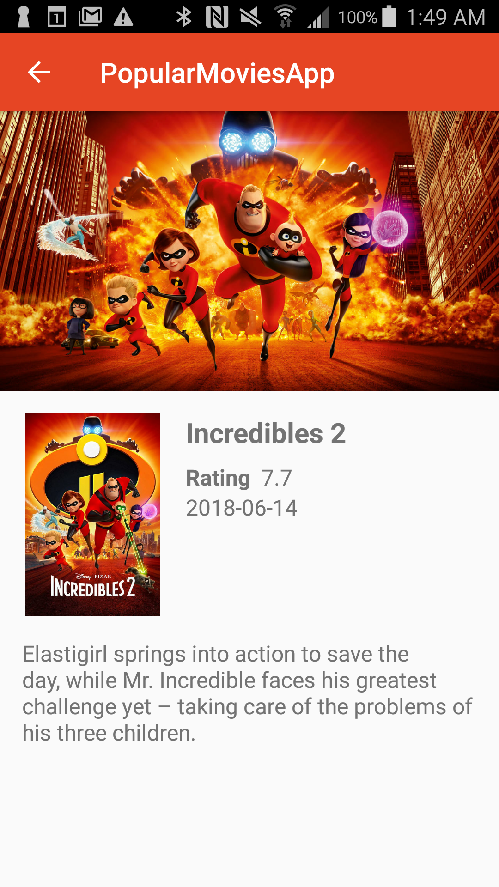

# Popular Movies App version 1.0

## Project Summary

Most of us can relate to kicking back on the couch and enjoying a movie with friends and family.
In this project, you’ll build an app to allow users to discover the most popular movies playing.

You’ll build the complete functionality of this app in two stages which you will submit separately.

## Instructions

Download or clone this repo on your machine, open the project using Android Studio. Once Gradle builds
the project, click "run" and choose an emulator.

Please put your key in your gradle.properties `THE_MOVIE_DB_KEY="my_movie_db_key"`

## Stage 1: Main Discovery Screen, A Details View, and Settings

### User Experience

In this stage you’ll build the core experience of your movies app.

Your app will:

- Upon launch, present the user with an grid arrangement of movie posters.
- Allow your user to change sort order via a setting:
  - The sort order can be by most popular, or by top rated
- Allow the user to tap on a movie poster and transition to a details screen with additional information such as:
  - original title
  - movie poster image thumbnail
  - A plot synopsis (called overview in the api)
  - user rating (called vote_average in the api)
  - release date

## Rubric

### Common Project Requirements

- [x] App is written solely in the Java Programming Language.
- [x] Movies are displayed in the main layout via a grid of their corresponding movie poster thumbnails.
- [x] UI contains an element (i.e a spinner or settings menu) to toggle the sort order of the movies by: most popular, highest rated.
- [x] UI contains a screen for displaying the details for a selected movie.
- [x] Movie details layout contains title, release date, movie poster, vote average, and plot synopsis.
- [x] App utilizes stable release versions of all libraries, Gradle, and Android Studio.

### User Interface - Function

- [x] When a user changes the sort criteria (“most popular and highest rated”) the main view gets updated correctly.
- [x] When a movie poster thumbnail is selected, the movie details screen is launched.

### Network API Implementation

- [x] In a background thread, app queries the /movie/popular or /movie/top_rated API for the sort
      criteria specified in the settings menu.

### General Project Guidelines

- [x] App conforms to common standards found in the Android Nanodegree General Project Guidelines
      (NOTE: For Stage 1 of the Popular Movies App, it is okay if the app does not restore the data using
      onSaveInstanceState/onRestoreInstanceState)
